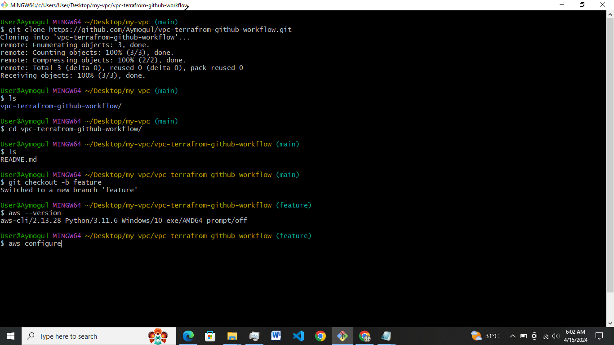
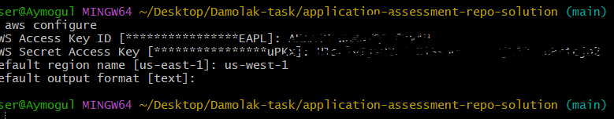
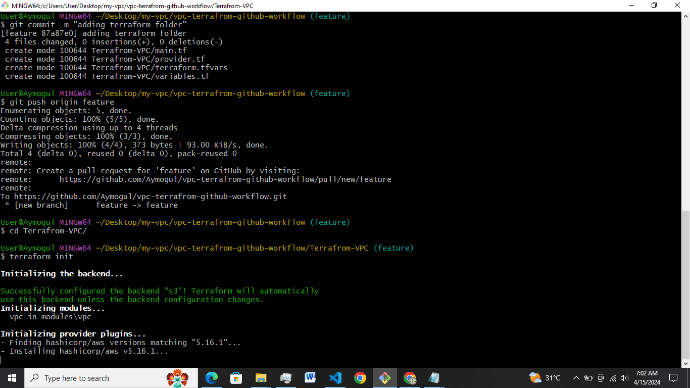
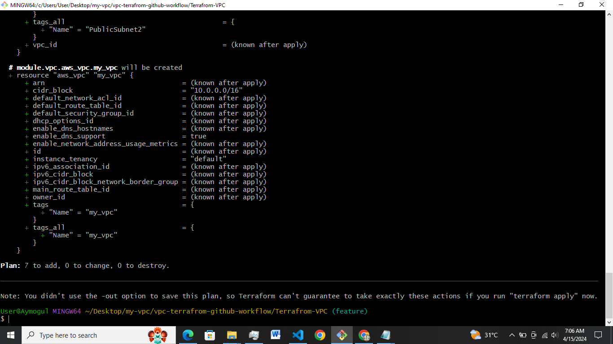
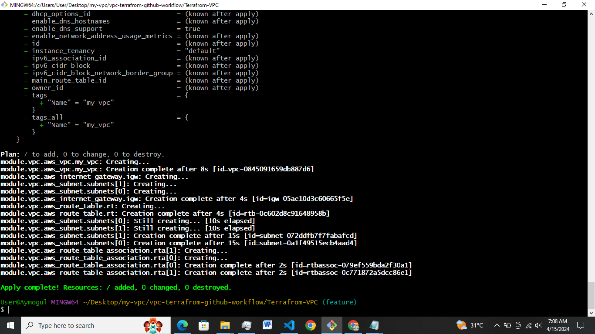
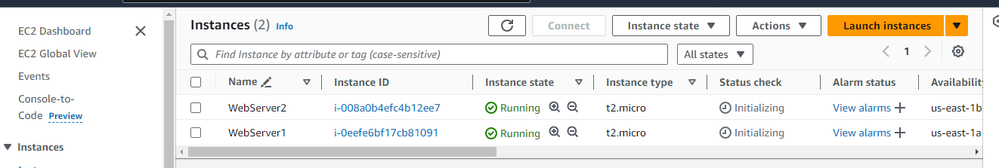
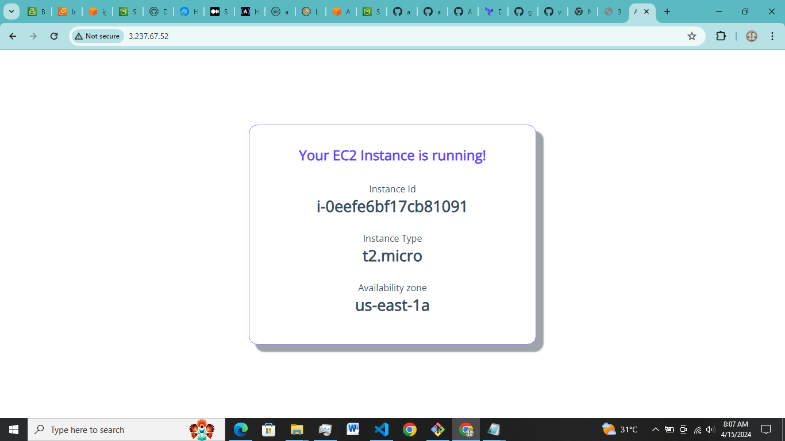

# VPC creation with TERRRAFORM and GitHub Action as CI/CD
This proect focuses on a wide range of best practices required for the deployment of a web page into a highly scalable and available infrastructure on AWS with Terraform being an IAC tool to achieve this.
GitHub action was also employed to enhance smooth workflow of continous integration and continous deployment by triggering the deploy.yaml on push from feature branch to the main branch.

In this project, the Instances are spanned across three different availability zones that provides the infra with High availability. 

## Project Requirement 
- AWS account 
- Github account
- Terraform 
- AWS CLI 
- AWS Access Key ID
- AWS secret access key

## Infrastucture
The AWS infrasctruture comprises of AWS services below:
- VPC
- Private Subnets (2)
- Public Subnets (2)
- Route Tables (Public, Private)
- Internet Gateway (1)
- NAT Gateway (1)
- Application Load Balancer
- EC2
- Security Groups
- us-east-1 region

 All resources packaged and deployed using terraform. In this project, the state file is stored in an s3 bucket `mogul-terrafrom-backend`. Most of the resources made use of terraform modules provided by AWS from the terraform documentation.

## CICD
 The cicd pipeline for the app is built using GitHub actions, for the CI part, the CI pipeline takes the code base, integrates any changes that is noticed in the code base and register the commit in form of short SHA.

 The CD pipeline takes up the github commit SHA and updates the neccessary process by initiating the terraform commands specified in the workflow. This whole process happens upon change in the github repo.

## Steps to follow
step 1:
clone your repo from github;
```git clone vpc-terrafrom-github-workflow```

step 2:
create branch
```git checkout -b feature```
step 3:
congigure your AWS CLI
```aws configure```





step 4:
intialize your terraform files
```cd Terraform-VPC```

```terraform init```



```terraform plan```



```terraform --auto-approve```



step 5:
check your infrastructure and access your web app through the load balancer endpoint 





## Replicate App

 To replicate this application, fork this repo on your github account and head over to settings > secrets & environemnt variables > Actions
  Add the following secrets based on naming conventions

  - AWS_ACCESS_KEY_ID
  - SECRET_ACCESS_KEY

 Also note that you have to update the bucket in your `provider.tf` in terraform

Make a Change in Any file, commit and push those changes. It will trigger the pipeline to deploy the infra on the cloud.

##THANK YOU

